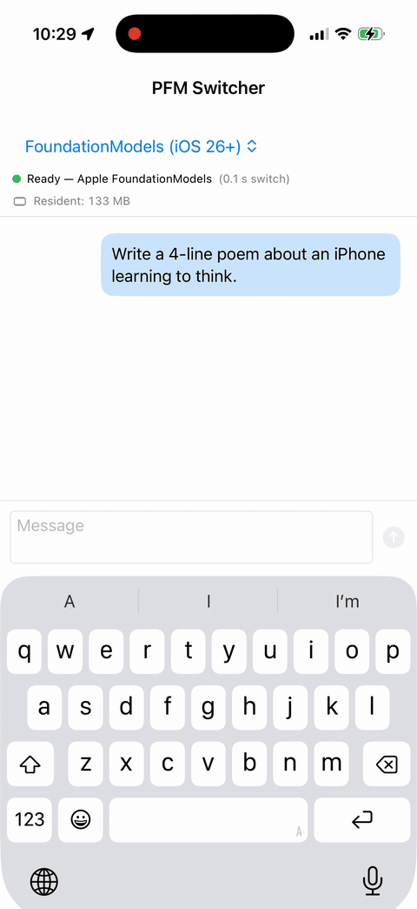

# PrivateFoundationModels

**Apple's [Foundation Models framework](https://developer.apple.com/documentation/foundationmodels) — without the iOS 26 requirement, and with any on-device model you choose.**

<p align="center">
  
</p>

```swift
import PrivateFoundationModels
import PrivateFoundationModelsCoreML

SystemLanguageModel.default = SystemLanguageModel(
    backend: try await CoreMLLanguageModel.load(.lfm2_5_350M)
)

let session = LanguageModelSession(
    instructions: "You are a Swift documentation assistant."
)

let reply = try await session.respond(to: "What is `async let`?")
print(reply.content)
```

That's the same `LanguageModelSession.respond(to:)` shape Apple ships in iOS 26 — running on iOS 18, on LFM2.5-350M, on the Neural Engine, fully on-device.

**Verified on Mac, not aspirational** — three harnesses run green against a real on-device model on the Apple Neural Engine:

- [`docs/VERIFICATION.md`](docs/VERIFICATION.md) — every public API path (10/10)
- [`docs/PORTABILITY.md`](docs/PORTABILITY.md) — Apple-FM-shaped call sites compile and run unchanged (8/8)
- [`docs/DEEP_VERIFICATION.md`](docs/DEEP_VERIFICATION.md) — every Generable shape × Tool pattern (44 stub tests + real-model PASS 7 / MODEL 4 / FAIL 0)

**Drop-in source compatibility with Apple `FoundationModels`** — the same code that uses Apple's framework on iOS 26 compiles unchanged against `PrivateFoundationModels` on iOS 18. The only diff is the `import` line plus a one-line backend install at app startup. Eight Apple-FM-shaped call sites — single-turn / multi-turn / trailing-closure instructions / streaming / `GenerationOptions` / `Generable` / `Tool` / transcript Codable — run green end-to-end. See [`docs/PORTABILITY.md`](docs/PORTABILITY.md) for the exact diff and the runtime log.

**First call downloads the model. No prep required.** `CoreMLLanguageModel.load(.lfm2_5_350M)` writes ~810 MB to `~/Library/Application Support/PrivateFoundationModels/lfm2.5-350m-coreml/` over a foreground URLSession and skips files already present on subsequent runs. Works from a CLI, an Xcode Preview, a unit test harness, or an iOS app — none of CoreML-LLM's background-URLSession assumptions apply.

---

## Why this exists

Apple's `FoundationModels` framework is great. It also has three real constraints:

| | Apple `FoundationModels` | `PrivateFoundationModels` |
|---|---|---|
| **Minimum OS** | iOS 26 / macOS 26 / visionOS 26 | iOS 18 / macOS 15 / visionOS 2 |
| **Model** | Apple's 3 B on-device model, locked | Any CoreML / MLX / GGUF bundle |
| **Adapter support** | Limited, ~90% context budget burned by adapter | Bring your own LoRA / fine-tune |
| **Domain coverage** | Apple-recommended only — coding, math, general Q&A all officially discouraged | Whatever your chosen model is good at |
| **API surface** | `LanguageModelSession` / `Instructions` / `Tool` / `Generable` | Same names, same shapes |

If you've already written code against Apple's framework, point it at `PrivateFoundationModels` and it builds. If you haven't, the migration path the day iOS 26 hits is `s/PrivateFoundationModels/FoundationModels/` and a deployment-target bump.

---

## Install

```swift
// Package.swift
dependencies: [
    .package(url: "https://github.com/john-rocky/PrivateFoundationModels", from: "0.1.0"),
],
targets: [
    .target(
        name: "MyApp",
        dependencies: [
            .product(name: "PrivateFoundationModels",        package: "PrivateFoundationModels"),
            .product(name: "PrivateFoundationModelsCoreML", package: "PrivateFoundationModels"),
        ]
    )
]
```

Two products:

- **`PrivateFoundationModels`** — the API surface (`LanguageModelSession`, `Instructions`, …). Zero runtime deps. Import this everywhere.
- **`PrivateFoundationModelsCoreML`** — the default backend. Depends on [`john-rocky/CoreML-LLM`](https://github.com/john-rocky/CoreML-LLM), which runs Gemma 4 / Qwen3.5 / Qwen3-VL / LFM2.5 / FunctionGemma / EmbeddingGemma on the Apple Neural Engine. Import only in the target that wires `SystemLanguageModel.default`.

Both are pure SPM. No CocoaPods. No special build phase. No model files in the repo — the backend downloads on first call.

You can also wire your own `LanguageModelBackend` (MLX-Swift, llama.cpp, a remote API) — see [Bring your own backend](#bring-your-own-backend) below.

### Model download

`CoreMLLanguageModel.load(...)` populates the model directory on the first call using a foreground URLSession; the second call sees every file already on disk and skips straight to the load step.

```swift
let backend = try await CoreMLLanguageModel.load(
    .lfm2_5_350M,
    cacheDirectory: nil,           // optional override; defaults to Application Support
    hfToken: nil,                  // optional, for gated repos
    onProgress: { print($0) }      // per-file events ("[3/12] hf_model/tokenizer.json (4.5 MB)")
)
```

Default cache path: `~/Library/Application Support/PrivateFoundationModels/<repo-basename>/`.

You don't need `huggingface-cli` installed, you don't need to pre-populate anything, and you don't need an iOS app context — the fetcher is a vanilla foreground `URLSession`. The CoreML-LLM upstream's background-`URLSession` downloader (which doesn't work from a plain CLI / Xcode Preview / unit-test process) is bypassed entirely.

If a download is interrupted, re-running picks up where it left off — files whose on-disk size matches the HuggingFace-reported size are skipped per-file.

---

## Quick tour

### Stateful chat

```swift
let session = LanguageModelSession(instructions: "Be terse.")

_ = try await session.respond(to: "Who wrote The Tale of Genji?")
_ = try await session.respond(to: "And in what century?")
// The second call sees the first in `session.transcript`.
```

### Streaming

```swift
let stream = session.streamResponse(to: "Write a haiku about autumn.")
for try await snapshot in stream {
    print(snapshot.content) // cumulative, not deltas
}
let final = try await stream.collect()
```

### Structured output

```swift
@Generable
struct CityReport {
    @Guide(description: "City name")
    let city: String
    let temperatureCelsius: Double
    let conditions: String
}

let report = try await session.respond(
    to: "Make up plausible weather for Tokyo in November.",
    generating: CityReport.self
)
print(report.content.temperatureCelsius)
```

`@Generable` is the same macro shape Apple ships in `FoundationModels` — it walks stored properties, picks a JSON-Schema type per field, drops `Optional` fields out of `required`, and recurses into nested `@Generable` types. `@Guide(description:)` is also supported. If you prefer to write the schema by hand (no macro), conform to `Generable` and supply `static var generationSchema` directly.

### Tools

```swift
struct LookupTool: Tool {
    struct Arguments: Generable {
        let city: String
        static var generationSchema: GenerationSchema {
            GenerationSchema(
                type: "object",
                properties: ["city": .init(type: "string")],
                required: ["city"]
            )
        }
    }
    let name = "lookup_weather"
    let description = "Returns the current temperature in °C for a city."
    func call(arguments: Arguments) async throws -> String {
        // Hit your real API here.
        "22"
    }
}

let session = LanguageModelSession(
    tools: [LookupTool()],
    instructions: "Use lookup_weather when asked about temperature."
)
let reply = try await session.respond(to: "How warm is it in Tokyo?")
```

Tool calls and tool outputs are recorded in `session.transcript` as `.toolCall` / `.toolOutput` entries so the conversation survives serialization.

### Persisting and restoring

```swift
let json = try session.transcript.serialized()
try json.write(to: url)
// ... later ...
let restored = try Transcript(serialized: Data(contentsOf: url))
let session = LanguageModelSession(transcript: restored)
```

### Sampling

```swift
let options = GenerationOptions(
    sampling: .random(top: 40, probabilityThreshold: 0.95, seed: 42),
    temperature: 0.7,
    maximumResponseTokens: 256
)
let answer = try await session.respond(to: "Tell me a story.", options: options)
```

---

## Model catalog

The CoreML backend ships with these defaults (see [`CoreMLLanguageModel.Catalog`](Sources/PrivateFoundationModelsCoreML/CoreMLLanguageModel.swift)):

| Catalog case | HuggingFace repo | Size | iPhone 17 Pro decode | v0.1 |
|---|---|---|---|---|
| `.lfm2_5_350M` | `mlboydaisuke/lfm2.5-350m-coreml` | 810 MB | ~52 tok/s | ✅ verified |
| `.gemma4E2B` | `mlboydaisuke/gemma-4-E2B-coreml` | 5.4 GB | ~34 tok/s | ✅ chunked path |
| `.gemma4E4B` | `mlboydaisuke/gemma-4-E4B-coreml` | 5.5 GB | ~14 tok/s | ✅ chunked path |
| `.qwen3_5_0_8B` | `mlboydaisuke/qwen3.5-0.8B-CoreML` | 1.2 GB | ~48 tok/s | ⚠ needs v0.2 generator routing |
| `.qwen3_5_2B` | `mlboydaisuke/qwen3.5-2B-CoreML` | 2.8 GB | ~27 tok/s | ⚠ same |
| `.qwen3VL2BStateful` | `mlboydaisuke/qwen3-vl-2b-stateful-coreml` | 2.3 GB | ~24 tok/s | ⚠ same |

Numbers from CoreML-LLM's published benchmarks. Any other CoreML bundle that CoreML-LLM can load via `CoreMLLLM.load(repo:)` works via `.custom("user/repo-coreml")`. The Qwen family loads through a separate Swift type in CoreML-LLM (`Qwen35MLKVGenerator`); routing those catalog entries through that path is the v0.2 milestone, see [`docs/VERIFICATION.md`](docs/VERIFICATION.md).

---

## Bring your own backend

`SystemLanguageModel` doesn't care how text is generated — it talks to a `LanguageModelBackend`. Implement two methods (`generate(...)` and `streamGenerate(...)`), and an `availability` property, and you can route the same Apple-FM-shaped surface to MLX-Swift, llama.cpp, a private inference server, or a remote API.

```swift
struct MyMLXBackend: LanguageModelBackend {
    let modelIdentifier = "mlx/my-finetune"
    var availability: SystemLanguageModel.Availability { .available }

    func prewarm() async { /* ... */ }

    func generate(
        transcript: Transcript,
        options: GenerationOptions,
        schema: GenerationSchema?,
        tools: [AnyTool]
    ) async throws -> BackendGeneration {
        let text = try await myMLXEngine.run(prompt: render(transcript))
        return BackendGeneration(text: text)
    }

    func streamGenerate(
        transcript: Transcript,
        options: GenerationOptions,
        schema: GenerationSchema?,
        tools: [AnyTool]
    ) -> AsyncThrowingStream<BackendDelta, Error> {
        AsyncThrowingStream { /* ... */ }
    }
}

SystemLanguageModel.default = SystemLanguageModel(backend: MyMLXBackend())
```

The session takes care of the transcript, the tool-call loop, and the `Generable` decode. Backends only have to render → run → emit text or a `toolCalls` array.

---

## Compatibility with `FoundationModels`

This package mirrors the public API surface of `FoundationModels` (iOS 26+) as of WWDC 2025 and the documentation available at the time of writing. Type names, initializer shapes, and method signatures match. A non-exhaustive list of what's implemented:

- `LanguageModelSession` — `respond(to:)`, `respond(to:generating:)`, `streamResponse(to:)`, `streamResponse(to:generating:)`, `prewarm()`, `transcript`, `isResponding`
- `Instructions`, `GenerationOptions`, `SamplingMode`
- `Response<Content>`, `ResponseStream<Content>` (AsyncSequence with `Snapshot`)
- `Transcript` + `Transcript.Entry` (Codable)
- `Tool` protocol, `AnyTool` type-erased wrapper
- `Generable` protocol with `GenerationSchema`
- `SystemLanguageModel` with `Availability` / `UnavailableReason`
- `GenerationError` matching Apple's case names where they exist

Things Apple's `FoundationModels` ships that we do **not** ship today, and explicitly do not promise:

- `Prompt` value type and the `respond(options:prompt:)` / `streamResponse(options:prompt:)` overloads that take it — v0.2.
- `Guardrails` (silent no-op accept-all today) — v0.2.
- `logFeedbackAttachment(...)` — v0.2+.
- Apple Intelligence-specific behavior (rewriting in Mail, image playgrounds). Those are app-level features, not framework surface.

If you find a method or initializer in Apple's docs that PFM doesn't ship, please open an issue.

---

## What this package is *not*

- **Not affiliated with Apple.** "Foundation Models" is Apple's trademark; this project is a community-maintained API-compatible alternative.
- **Not a model.** It's a thin Swift surface that delegates to whatever backend you wire up.
- **Not a grammar-constrained sampler.** When you ask for a `Generable` response, we feed the schema to the model as part of the system prompt and post-process. For deterministic schema enforcement, use a backend that supports a constrained sampler (Outlines, LM Format Enforcer, Apple FM's own grammar mode).

---

## Examples

- [`Examples/PFMChat/`](Examples/PFMChat/) — single-file SwiftUI chat app (~200 lines). Loads `mlboydaisuke/lfm2.5-350m-coreml`, streams responses.
- [`Examples/PFMSwitcher/`](Examples/PFMSwitcher/) — production-shaped chat app that **switches between Apple `FoundationModels` (iOS 26+) and any CoreML catalog model** with a single picker. Demonstrates the strict release-before-load pattern needed when one of the resident models is 5+ GB on ANE. Includes live RSS readout and a `didReceiveMemoryWarningNotification` handler.

## Verified

Captured on Apple M4 Max / macOS 26.0 / Swift 6.2.1, against `mlboydaisuke/lfm2.5-350m-coreml` on the Apple Neural Engine:

| Harness | What it proves | Result |
|---|---|---|
| `swift test` | Session logic, schema decoder, tool dispatch, error wrapping — all stub-backed for determinism | **44 / 44 pass** ([deep tests](docs/DEEP_VERIFICATION.md)) |
| `swift run -c release pfm-verify` | Every public API path against a real model | **10 / 10 pass** ([log](docs/pfm-verify.log)) |
| `swift run -c release pfm-portability` | Real Apple-FM-shaped code compiled and ran unchanged | **8 / 8 pass** ([log](docs/pfm-portability.log)) |
| `swift run -c release pfm-deep` | Every Generable shape × Tool pattern against the real model | **PASS 7 / MODEL 4 / FAIL 0** ([log](docs/pfm-deep.log)) |

`MODEL` = API works, content quality limited by the 350 M-parameter model used for verification (a larger model lands the test in PASS). `FAIL` = framework / backend regression — zero is the only acceptable number.

## Roadmap

- v0.1 — Core API + CoreML backend + foreground HF fetcher (this release)
- v0.2 — `@Generable` macro for auto-schema derivation
- v0.3 — Qwen3.5 / Qwen3-VL routing through `Qwen35MLKVGenerator` for the catalog entries that today need v0.2
- v0.4 — MLX-Swift backend
- v0.5 — llama.cpp / GGUF backend
- v0.6 — Grammar-constrained decoding for the CoreML backend
- v0.7 — Vision input on the session API (`respond(to:image:)` for Qwen3-VL / Gemma 4 multimodal)

---

## Author

[Daisuke Majima](https://github.com/john-rocky) ([@JackdeS11](https://x.com/JackdeS11)) — ex-Ultralytics, founder of [Pebble Inc.](https://pebble.co.jp). Maintainer of [`CoreML-Models`](https://github.com/john-rocky/CoreML-Models) (1.7k★), [`CoreML-LLM`](https://github.com/john-rocky/CoreML-LLM), and the [`mlboydaisuke`](https://huggingface.co/mlboydaisuke) Apple Silicon model collection on Hugging Face.

Open to consulting on Apple Silicon LLM inference, on-device deployment, and CoreML / MLX optimization — [pebble.co.jp](https://pebble.co.jp).

## License

MIT. See [LICENSE](LICENSE). Model weights inherit their own licenses (Gemma: Gemma Terms; Qwen: Apache 2.0; LFM2.5: LFM Open License v1.0).
