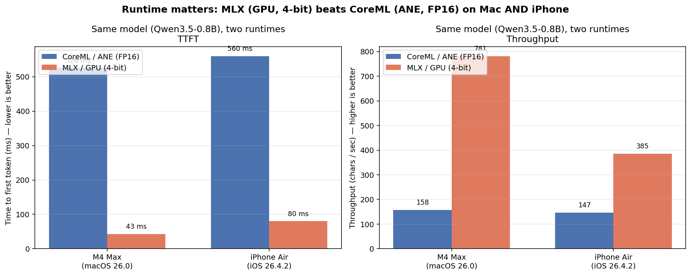

# Same model, different runtimes — Qwen3.5-0.8B on Mac and iPhone



PFM exposes one Apple-FM-shaped surface and routes generation to whichever runtime you install — Apple's native FoundationModels, CoreML on the Apple Neural Engine, or MLX on Apple Silicon GPU. **Same call site, same prompt, very different latency / throughput.**

This page benches `Qwen3.5-0.8B` on the two runtimes that ship it (CoreML + MLX), plus Apple's native 3 B model and CoreML LFM2.5-350M as reference points. All numbers from `swift run -c release pfm-bench-*` on Apple M4 Max / macOS 26.0 / Xcode 26.1.1, and from the bundled `PFMiPhoneBench` app on iPhone Air (`iPhone18,1`) / iOS 26.4.2 — release builds, median of 3 timed iterations after one untimed warmup.

## Headline

### Apple M4 Max (macOS 26.0)

| Backend | Model | Quant | Load | TTFT | Total | Output chars | Throughput |
|---|---|---|---|---|---|---|---|
| **MLX / GPU** | **Qwen3.5-0.8B** | **4-bit** | **1 028 ms** | **43 ms** | **114 ms** | 89 | **781 chars/sec** |
| Apple FM | Apple's 3 B (`.general`) | (Apple's own) | 0 ms | 298 ms | 581 ms | 147 | 253 chars/sec |
| Apple FM | Apple's 3 B (`.contentTagging`) | (Apple's own) | 1 ms | 496 ms | 523 ms | 53 | 101 chars/sec |
| **CoreML / ANE** | **Qwen3.5-0.8B** | **FP16-ish** | 13 224 ms | 526 ms | 1 921 ms | 303 | 158 chars/sec |
| CoreML / ANE | LFM2.5-350M (SSM) | FP16-ish | 2 579 ms | 530 ms | 644 ms | 25 | 39 chars/sec |

### iPhone Air, `iPhone18,1` (iOS 26.4.2)

| Backend | Model | Quant | Load | TTFT | Total | Output chars | Throughput |
|---|---|---|---|---|---|---|---|
| **MLX / GPU** | **Qwen3.5-0.8B** | **4-bit** | 86 980 ms¹ | **80 ms** | **231 ms** | 89 | **385 chars/sec** |
| Apple FM | Apple's 3 B (`.general`) | (Apple's own) | 1 ms | 282 ms | 472 ms | 122 | 258 chars/sec |
| **CoreML / ANE** | **Qwen3.5-0.8B** | **FP16-ish** | 1 151 978 ms¹ | 560 ms | 2 062 ms | 303 | 147 chars/sec |
| CoreML / ANE | LFM2.5-350M (SSM) | FP16-ish | — | — | — | — | failed to compile on device² |

¹ First-run load includes HuggingFace download over LTE / Wi-Fi; subsequent loads are cached. The interesting load number is M4 Max (no network).
² LFM2.5 `mlpackage` failed to build on iOS 26.4.2 (`CoreML failed to build model`); the model loads fine on macOS 26.0 with the same package. Tracking — likely opset / SSM op not yet supported by the iOS CoreML compiler.

Raw CSV: [`docs/BENCHMARKS.csv`](BENCHMARKS.csv) — accumulates per-hardware contributions over time.

## Same model on CoreML vs MLX

This is the apples-to-apples row. Same architecture (`Qwen3.5-0.8B`), same prompt, same `GenerationOptions(temperature: 0.0, maximumResponseTokens: 80)`. Different runtime, different quantization.

```
M4 Max — TTFT (ms, lower is better)
                       0     200     400     600
─────────────────────  ┼───────┼───────┼───────┼
CoreML  / ANE  FP16     ████████████████████████████  526
MLX     / GPU  4-bit    ██                            43   ← 12.2× faster

M4 Max — Throughput (chars/sec, higher is better)
                       0    200    400    600    800
─────────────────────  ┼─────┼──────┼──────┼──────┼
CoreML  / ANE  FP16    ██████                        158
MLX     / GPU  4-bit   ██████████████████████████    781  ← 5.0× faster

iPhone Air — TTFT (ms, lower is better)
                       0     200     400     600
─────────────────────  ┼───────┼───────┼───────┼
CoreML  / ANE  FP16     ██████████████████████████   560
MLX     / GPU  4-bit    ████                          80  ← 7.0× faster

iPhone Air — Throughput (chars/sec, higher is better)
                       0    100    200    300    400
─────────────────────  ┼─────┼──────┼──────┼──────┼
CoreML  / ANE  FP16    ███████████                   147
MLX     / GPU  4-bit   ████████████████████████████  385  ← 2.6× faster
```

**The runtime gap holds on iPhone too.** MLX (Metal GPU, 4-bit) beats CoreML (ANE, FP16) by 7× on TTFT and 2.6× on throughput for the same Qwen3.5-0.8B weights. The advantage is smaller than on M4 Max (12.2× / 5.0×) — the iPhone GPU is closer to its ANE than M4 Max's GPU is — but it's still big enough that "CoreML is always the iPhone default" is just folklore.

### Caveats — read these before tweeting the numbers

1. **Not the same precision.** MLX is 4-bit; CoreML build of the same repo is FP16-ish. ~3× of the throughput gap is the quant alone; the remaining ~1.7× is runtime/hardware path (GPU Metal vs ANE).
2. **Different output lengths.** Within the same 80-token cap, MLX stopped at 89 chars (~80 tokens of concise reply); CoreML kept generating to 303 chars before hitting the cap. The chars/sec metric is honest (output bytes / wall time) but doesn't normalize for "how much did the model decide to say."
3. **Both stop conditions are model-controlled.** Same prompt, but Apple's framework and the upstream Qwen instruction-tuning differ in verbosity defaults. Throughput is the cleaner of the two metrics for runtime comparison; TTFT is unambiguous.
4. **iPhone energy is unmeasured.** ANE is more energy-efficient per token than the GPU on iPhone — this bench measures latency and throughput, not joules. If your app generates continuously (live captions, agents, etc.), the CoreML / ANE path may still win on battery even though MLX wins on wall-clock.
5. **iPhone first-load is dominated by network.** The 87 s MLX load and 1 152 s CoreML load on iPhone are first-run HuggingFace downloads. Subsequent launches load from disk in single-digit seconds. Bench again after warm cache if you want the steady-state number.

## Apple FM as a reference point

Apple's native on-device LLM (`SystemLanguageModel.default` on iOS 26+) is a 3 B-class model — bigger than Qwen3.5-0.8B but smaller than mid-range cloud models. It sits between the two Qwen runtimes on PFM's bench:

- 5.9× faster TTFT than CoreML/ANE on Qwen 0.8B (despite being a much bigger model).
- 6.9× slower TTFT than MLX/GPU on Qwen 0.8B 4-bit.

The big wins for Apple FM in PFM:
- **Zero load time.** The model is built into the OS — no download, no MLPackage compile, no Metal shader paging.
- **Schema-enforced JSON** via Apple's grammar-constrained sampler. CoreML / MLX use prompt-injection + post-process for `@Generable`.
- **Guardrails managed by Apple.** Not always what you want, but a thing.

The big wins for the other backends:
- **MLX:** raw speed on Apple Silicon GPU. Bring-your-own-model.
- **CoreML:** ANE / battery efficiency on iPhone (and yes, MLX on iPhone is still GPU; CoreML wins energy there).

## When to pick which runtime

| You want | Pick |
|---|---|
| Fastest first token, Mac dev box | MLX |
| Smallest binary footprint, iPhone, your own model | CoreML |
| Zero download, Apple's grammar sampler, iOS 26+ only | Apple FM |
| One call site that runs on all three depending on what's available | PFM |

## Reproducing

### Mac

```bash
# CoreML (works from SPM CLI)
swift run -c release pfm-bench-coreml --model qwen3.5-0.8B --csv-append docs/BENCHMARKS.csv

# MLX (needs xcodebuild — Metal shaders)
xcodebuild -scheme pfm-bench-mlx -configuration Release \
  -destination "platform=macOS" -skipMacroValidation build
$(find ~/Library/Developer/Xcode/DerivedData -name pfm-bench-mlx -path "*Release*" -type f | head -1) \
  --csv-append docs/BENCHMARKS.csv

# Apple FM (macOS 26+, Apple Intelligence on)
swift run -c release pfm-bench-apple --csv-append docs/BENCHMARKS.csv
```

Pass `--hardware "<your label>"` if you want a friendlier name than the auto-detected CPU brand string (`Apple M4 Max`, `Apple M2`, etc.).

### iPhone

```bash
# Generate the xcodeproj and open it once to set your own development team.
cd Examples/PFMiPhoneBench
xcodegen
open PFMiPhoneBench.xcodeproj
```

Build to your device once from Xcode (Cmd-R). The app auto-starts the bench
on first appearance, runs Apple FM + CoreML + MLX (median of 3), and writes
`pfm-bench-latest.csv` into the app's Documents container after every
backend so a mid-run crash doesn't lose data. Tap **Share CSV** to AirDrop
or Files-export the result, then append the rows to
[`docs/BENCHMARKS.csv`](BENCHMARKS.csv) and open a PR.
